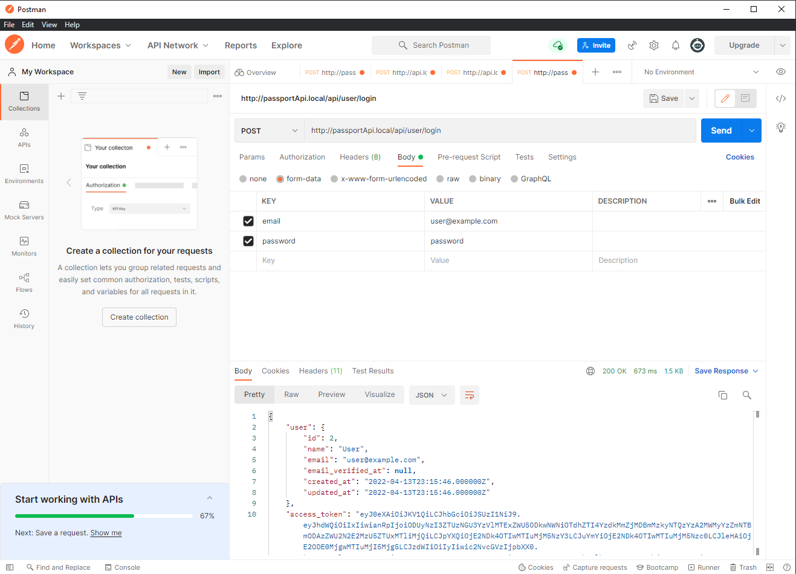
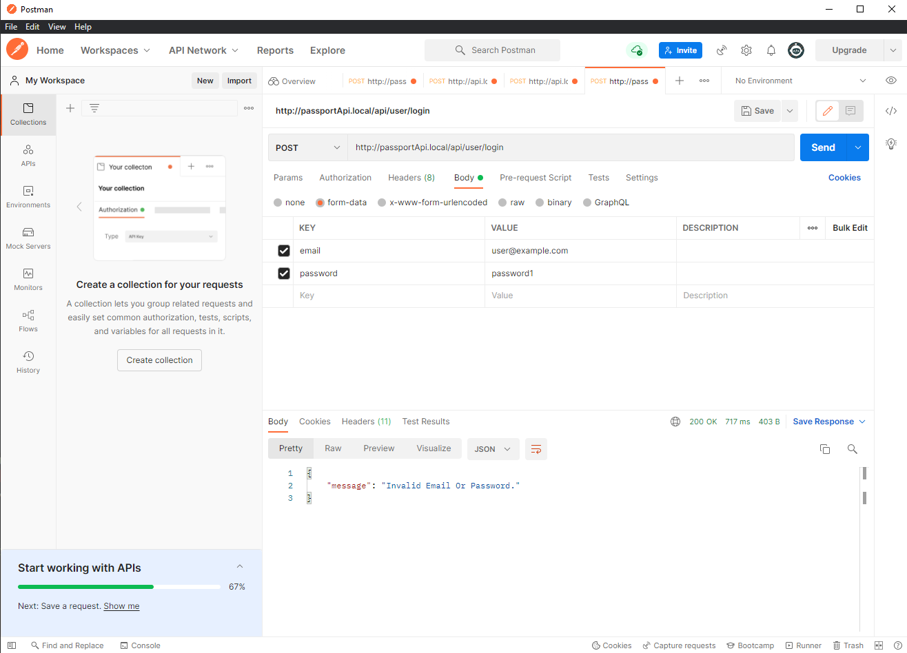

This project using REST API in Laravel with authentication using Passport.

# Create a user

Go to the file directory and enter the command line:
````
php artisan tinker
````
Then create a new user in the database:
````
App\Models\User::create(['name' => 'user', 'email' => 'user@example.com', 'password' => bcrypt('password')]);
````
After that, you can exit tinker by typing 'exit'.

So let's try on Postman

Let's enter the user information correctly:

<p align="center" style="padding: 10px">
    

If we enter wrong user information, it will return us an error message:

<p align="center" style="padding: 10px">
    

The next function is user creation..
